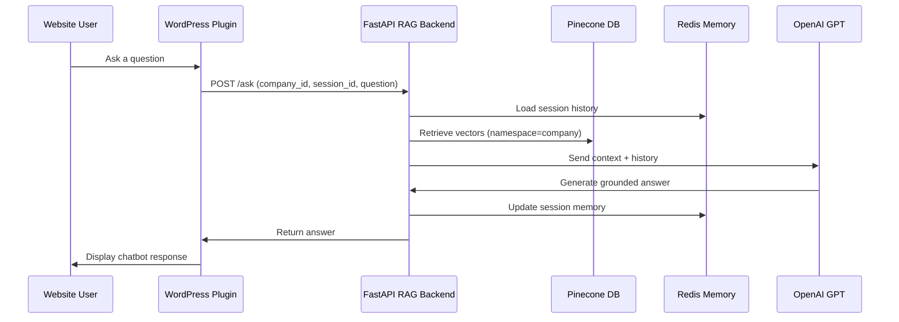

Got it ✅
Here’s the **full combined README.md** (all sections integrated into one clean document).

---

````markdown
<!-- ------------------------------------------------------------------- -->
<!--    Multi-Tenant RAG API – README                                    -->
<!-- ------------------------------------------------------------------- -->

<h1 align="center">Multi-Tenant RAG API 🤖📚</h1>
<h4 align="center">AI-powered support chat for multiple companies, backed by PDFs + WordPress integration</h4>

<p align="center">
  
  
</p>

---

## ✨ What is this?

**Multi-Tenant RAG API** is a **FastAPI backend** that powers customer-support chatbots for different companies (e.g., DigiRoam, DigiCom, DigiTech).  

- Upload company PDFs 📂  
- Store & index embeddings in **Pinecone**  
- Query with **RAG (Retrieval-Augmented Generation)** via **OpenAI GPT-4o-mini**  
- Maintain **session-based memory** in **Redis**  
- Connect seamlessly with **WordPress websites** via plugin  

|                      |                                                                                  |
|----------------------|----------------------------------------------------------------------------------|
| **Use case**         | Multi-company support chatbots linked to each WordPress site                     |
| **Tech stack**       | FastAPI · LangChain · OpenAI · Pinecone · Redis · pdfplumber                     |
| **Status**           | **Stable v1.0** – optimized for production deployment on Linux servers           |

---

## 🚀 Key Features

| Feature | Details |
|---------|---------|
| 🏢 **Multi-Tenant Isolation** | Each company uses its own Pinecone namespace (e.g. `tenant_digicom`, `tenant_digitech`) |
| 📄 **PDF Uploads** | Upload any PDF (validated for size & length), automatically chunked & embedded |
| 🔎 **Hybrid Retrieval** | Uses **Pinecone vectors + BM25 keyword retriever** for more accurate context |
| 🧠 **Session Memory** | Maintains conversation history per session (via Redis) with auto-expiry (e.g. 5 mins) |
| 💬 **Context-Grounded Answers** | GPT-4o-mini responds **only from uploaded PDFs**, no hallucinations |
| 🔐 **Admin Tools** | Endpoints to delete vectors by `pdf_hash` or entire `company_id` |
| 🌐 **WordPress Ready** | Easily integrated into WordPress websites via REST plugin |

---

## ⚙️ Quick Start (Run Locally)

### 🧑‍💻 1. Clone the Repository

```bash
git clone https://github.com/your-username/multi-tenant-rag-api.git
cd multi-tenant-rag-api
````

---

### 📦 2. Create a Virtual Environment

```bash
python -m venv venv
# Activate it:
# On Linux/Mac:
source venv/bin/activate
# On Windows:
venv\Scripts\activate
```

---

### 📂 3. Install Dependencies

```bash
pip install -r requirements.txt
```

---

### 🔐 4. Add Your API Keys

Create a `.env` file in the root directory of the project and add:

```env
OPENAI_API_KEY=sk-xxxxxxxxxxxxxxxxxxxxxxxxxxxxxxxx
PINECONE_API_KEY=pcd-xxxxxxxxxxxxxxxxxxxxxxxxxxxxxx
REDIS_HOST=localhost      # or your Redis Cloud host
REDIS_PORT=6379
REDIS_PASSWORD=your_redis_password
```

⚠️ Make sure `.env` is listed in `.gitignore` to avoid committing sensitive keys.

---

### 🚀 5. Run the FastAPI App

```bash
uvicorn main:app --reload
```

The app will open at:

```
http://127.0.0.1:8000
```

Docs (protected with Basic Auth) at:

```
http://127.0.0.1:8000/api-endpoint-links
```

---

## 📄 API Endpoints

### 📥 Upload PDF

`POST /upload_pdf/`

Form data:

```json
{
  "file": "<PDF file>",
  "company_id": "paragondigitech.com"
}
```

Response:

```json
{
  "stored": true,
  "hash": "abcdef123456...",
  "msg": "Stored embeddings in Pinecone.",
  "chunks": 42
}
```

---

### 💬 Ask a Question

`POST /ask/`

```json
{
  "company_id": "paragondigitech.com",
  "question": "What services does DigiTech provide?",
  "session_id": "user12345",
  "hash": ""
}
```

Response:

```json
{
  "answer": "DigiTech provides Social Media Marketing, Digital Advertising, SEO, Web Development & Design, and Digital PR services."
}
```

---

### ❌ Delete Vectors

Delete by **hash** or entire **company**.

`DELETE /delete_pdf_vectors/`

```json
# Option 1: delete by hash
{
  "hash": "abcdef123456"
}

# Option 2: delete all PDFs for a company
{
  "company_id": "paragondigitech.com"
}
```

---

## 🧠 Memory (Redis)

* Each chat session stores history in Redis under a unique `session_id`.
* Expiry (TTL) is configurable (e.g. **5 minutes**).
* If the user reloads the WordPress site → new session starts fresh.

---

## 🏗️ Deployment

### On Linux Server

1. Install dependencies:

   ```bash
   sudo apt update && sudo apt install python3-pip python3-venv -y
   ```
2. Install & run Redis (or use Redis Cloud).
3. Deploy API with **Uvicorn/Gunicorn + Nginx** as reverse proxy.
4. WordPress plugin points to `/ask/` endpoint.

---

## 📊 Architecture (Flow)



---

## 📜 License

MIT License © 2025

---

```

---

Would you like me to also add a **sample `.env.example` file** in the repo (so new developers know exactly what variables to set), or just keep instructions inside README?
```
